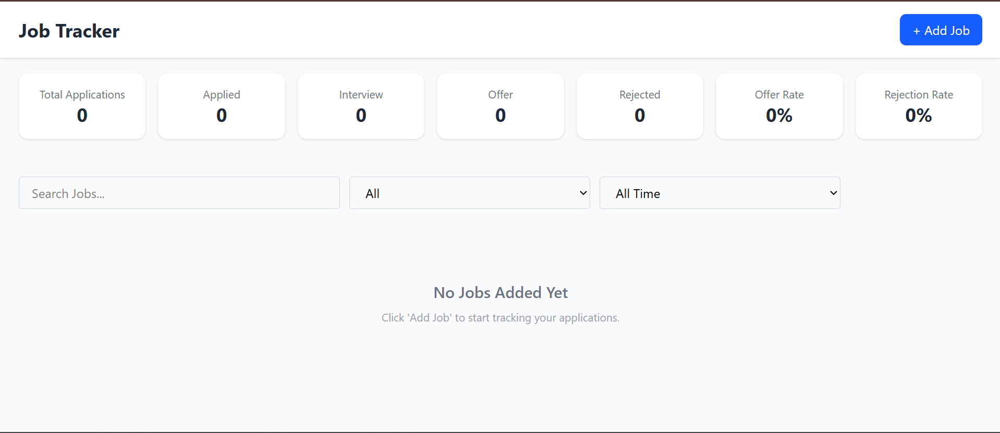
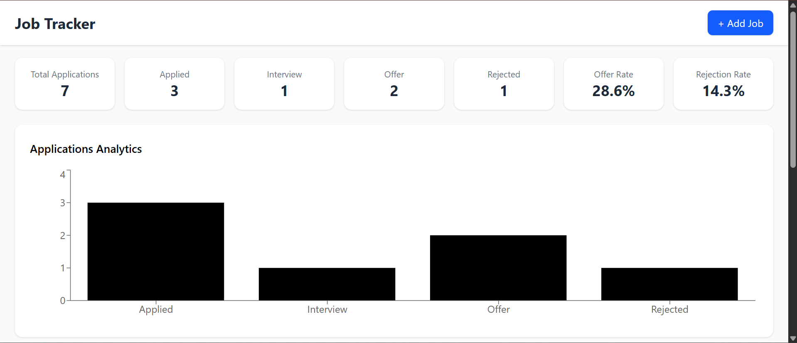
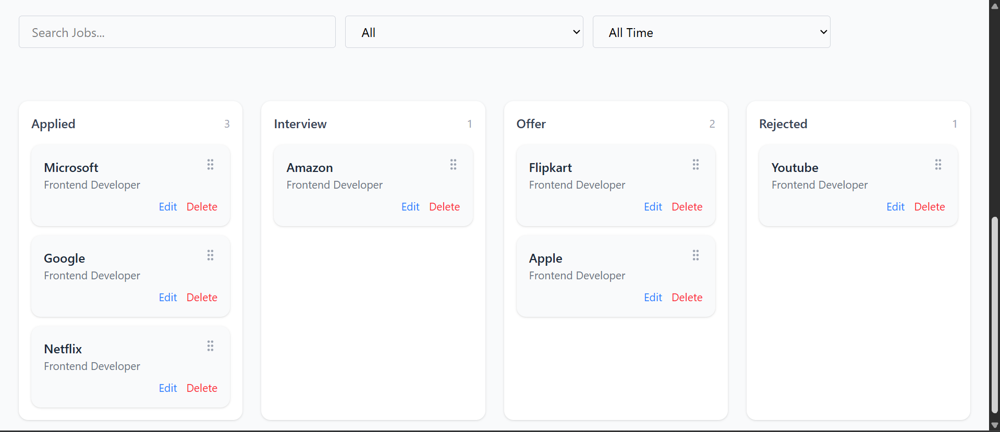
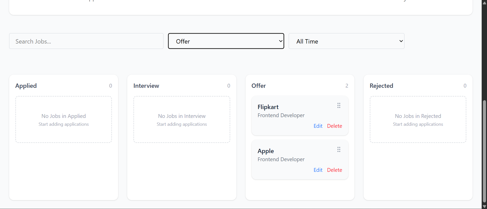
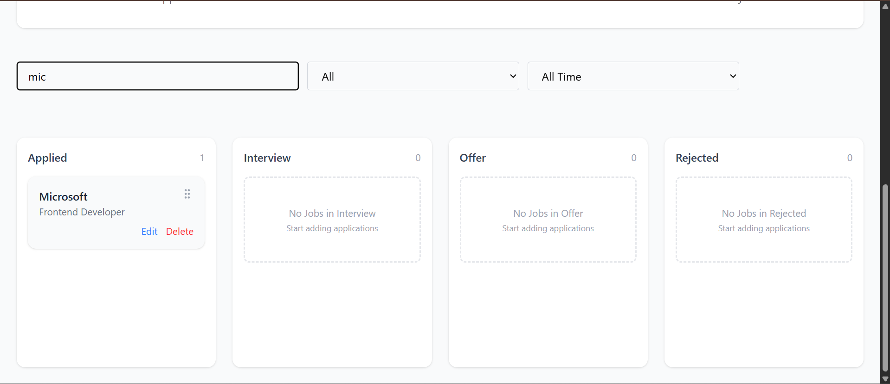

# 🚀 Job Application Tracker

🔗 **Live Demo:** https://job-tracker-app-livid.vercel.app/  
💻 **Source Code:** https://github.com/hardiksingla0003/job-tracker

A modern and responsive **Job Application Tracker** built with **React (Vite)** and **Tailwind CSS**.  
The application allows users to manage job applications efficiently with drag-and-drop functionality, advanced filtering, debounced search, and real-time analytics.

---

## 📸 Screenshots

### 🏠 Empty Dashboard



### 📋 Jobs Added




### 🔄 Drag & Drop in Action


### 🔍 Filters & Search




---

## ✨ Features

- Add, edit, and delete job applications
- Drag & drop between application statuses
- Debounced search for optimized filtering
- Filter by status and date range
- Dynamic statistics dashboard (Offer rate, Rejection rate)
- Persistent state using LocalStorage
- Fully responsive design

---

## 🛠 Tech Stack

- **React (Vite)** — Frontend framework
- **Tailwind CSS** — Styling
- **Context API + useReducer** — State management
- **Custom Hooks** — Reusable logic abstraction
- **@dnd-kit/core** — Drag & Drop interaction
- **Vercel** — Deployment & CI/CD

---

## 🏗 Architecture Highlights

- Clean and scalable folder structure
- Separation of concerns (components, hooks, context)
- Performance optimization using `useMemo`
- Centralized state management
- Modular and reusable components

---

## 🚀 Run Locally

```bash
git clone https://github.com/hardiksingla0003/job-tracker.git
cd job-tracker
npm install
npm run dev
```
